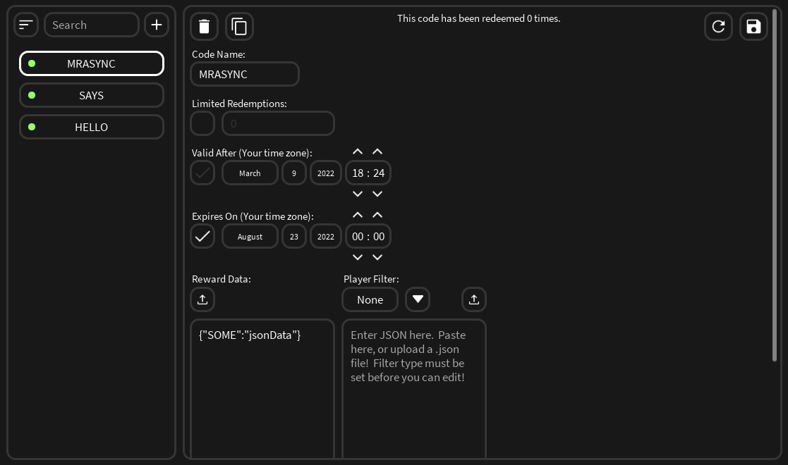

## About

This repository contains various systems, modules and services created by me.  The purpose of these to show advertise the quality and consistency of the code I write.  Below you can find some short descriptions of what the specific modules are, and how they were impactful.

## SuperStackCore

This is the module loader responsible for aggregating the packages produced for the Supersocial SuperStack.  The SuperStack is a platform that allows developers like myself to easily create, manage and distribute packages (collections of modules pertaining to a single purpose) to games and their developers.  The SuperStack was written to support drag-and-drop installation of new packages.  On runtime, the SuperStack moves package modules to either the server, client or shared directories.  The SuperStack is also the dependency manager for the packages and outside users.  You'll see the SuperStack referenced in many of the other examples, and you'll be able to get an understanding of how it was used.

## NetworkService

NetworkService is a core package bundled with the SuperStack.  NetworkService abstracts Remote Events and Functions from developers.  Developers are given APIs to create and interact with remotes.  These APIs are all Promisified not only for the technical benefits but also to promote good programming practices.  While simple, the NetworkService has proved to be powerful when writing client+server packages for the SuperStack where physical Remote instances cannot be used.

## PlayerData

This package was responsible for moving tremendous amounts of data through four different games created by Supersocial.  The PlayerData package was used to hold data pertaining to the SuperStack, explained below.  This package includes player caches, used for setting session-only values like debunces, time counts etc.  This package also features internal replication of player data.

## UtilityPanel

By far one of the most useful packages created so far during my current employment at Supersocial. The UtilityPanel allows developers to write a small amount of code that can be executed from a client side GUI that's auto generated with Fusion at runtime.  Developers can create categories and actions in those categories.  The actions can have arguments with different types such as `string`, `boolean`, `Player`, `Vector3` and `Enum`.  The intuitive GUI lets the developer quickly and efficiently run debug functions to test their code.  An example of this can be found in the README inside the UtilityPanel directory.

## PromoCodeService

The server component of the PromoCode package.  The goal of this package was to write a single, bulletproof promotional code (Twitter code) package that all games at Supersocial could use.  This was to not only remove the need for the game teams` to reinvent the wheel, but to give identical and consistent behavior between the games.  This package was also paired with the creation of a PromoCodeManager plugin, imaged below.  This plugin allowed developers and people with little technical knowledge to create and edit promotional codes.

